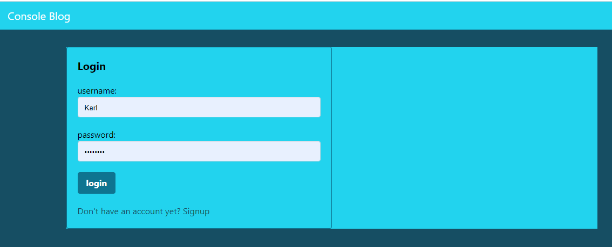

# Console Blog - Module 14 Challenge  
An online blog site for devs to learn from their peers and share their knowledge of the industry.  

##  
## Developer Info  
- Developed by Karl Linfeldt 
- [Live Page Deployment](https://crimson-badger.herokuapp.com/)
- [Github Repo](https://github.com/KarlOL82/techBlog)  
- [email](klinfeldt@gmail.com)  

## User Story  
AS A developer who writes about tech
I WANT a CMS-style blog site
SO THAT I can publish articles, blog posts, and my thoughts and opinions 

## Overview  
This application runs in Node Js with Express, MySQL, Sequelize, and Handlebars. It is deployed with Heroku via Github. The app allows users to create a profile with unique username and password and, once logged in, they can create blog-style posts, comment on others' posts, and delete and edit comments that they have made.  

## Istalling and Running the App  
There is no installation required for this application as it is deployed to Heroku. Simply  navigate to the deployed page and click the "Login" tab in the upper right. For first-time users; select the "signup" option on the login screen and create a username and password. Once you are logged in you will have access to all of the site's features. If you do no wish to login or create an account, you will be able to view existing posts and comments in a read-only capacity.  

## License
    
  https://opensource.org/licenses/MIT  

  This application is using the MIT license.  

## Screenshots  

  

  

  

